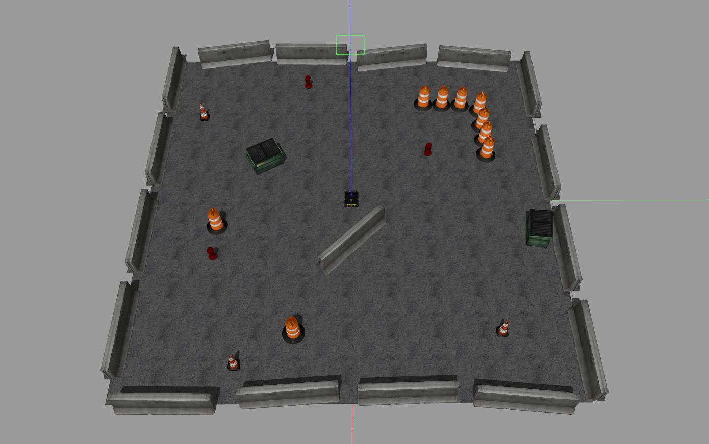
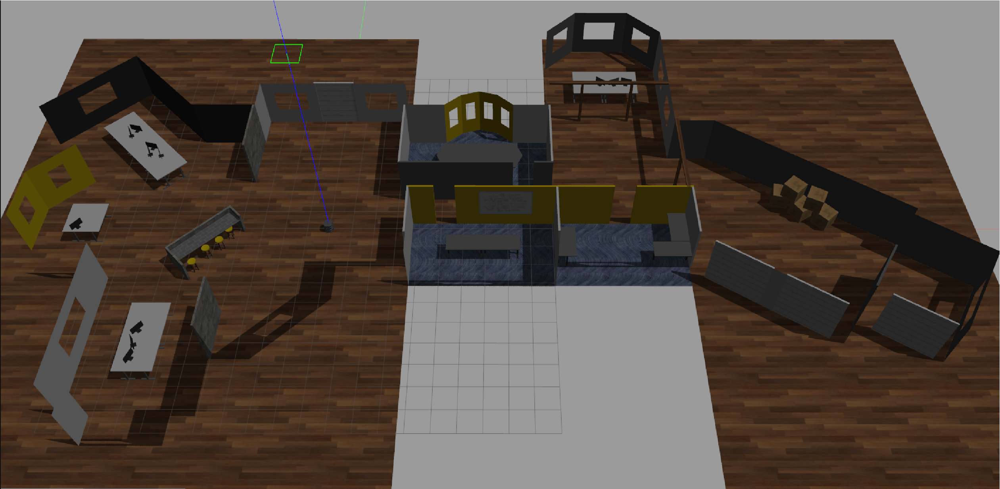

# DynamicEntropyExplore

## Overview

This is a template: replace, remove, and add where required. Describe here what this package does and what it's meant for in a few sentences.
This package contains the files 

**Keywords:** mobile robotics, autonomous mobile robotics, robot navigation, entropy, information theory.

### License

The source code is released under a [BSD 3-Clause license](ros_package_template/LICENSE).

**Author: Jaime Godoy-Calvo, Dahui Lin-Yang, Ricardo Váquez-Martín, Alfonso García-Cerezo 
Affiliation: [ISA, Universidad de Málaga](https://www.uma.es/isa) 
Maintainer: Ricardo Vázquez-Martín, rvmartin@uma.es**

The DynamicEntropyExplore package has been tested under [ROS] Melodic on Ubuntu 18.04.
This is research code, expect that it changes often and any fitness for a particular purpose is disclaimed.

### Publications

This work was used in an academic context.
If you use this work in an academic context, please cite the following publication(s):

* P. Fankhauser, M. Bloesch, C. Gehring, M. Hutter, and R. Siegwart: **PAPER TITLE**. IEEE/RSJ International Conference on Intelligent Robots and Systems (IROS), 2015. ([PDF](http://dx.doi.org/10.3929/ethz-a-010173654))

        @inproceedings{Fankhauser2015,
            author = {Fankhauser, P\'{e}ter and Hutter, Marco},
            booktitle = {IEEE/RSJ International Conference on Intelligent Robots and Systems (IROS)},
            title = {{PAPER TITLE}},
            publisher = {IEEE},
            year = {2015}
        }

## Installation

### Installation from Packages

To install all packages from the this repository use `rosdep`:

	sudo rosdep install --from-paths src --ignore-src -r -y
    

### Building from Source

#### Dependencies

- [Robot Operating System (ROS)](http://wiki.ros.org) (middleware for robotics)
- [Catkin Tools](https://catkin-tools.readthedocs.io/en/latest/index.html)

		sudo apt-get update
		sudo apt-get install python3-catkin-tools
	

#### Building

To build from source, clone the latest version from this repository into your catkin workspace and compile the package using

	git clone https://github.com/Jagoca98/DynamicEntropyExplore.git
	cd DynamicEntropyExplore/src
	rosdep install --from-paths . --ignore-src
	catkin build

## Usage

This package allow to perform an exploration in 2 different environments. The setup node will setup the world file and the needed nodes to perform an exploration. The exploration node will start the exploration of the environment.

Run the setup node for the `clearpath_playpen.world`:

	roslaunch fringa_pkg todo.launch

or run the `office.world` instead:

	roslaunch fringa_pkg office_todo.launch

The explore_costmap launch will start the run the exploration. This must be run in another terminal

	roslaunch fringa_pkg explore_costmap.launch

## Launch files

* **todo.launch:** It loads the playpen environment to perform an exploration with the [husky](https://clearpathrobotics.com/husky-unmanned-ground-vehicle-robot/).

* **office_todo.launch:** It loads the office environment to perform an exploration with the [turtlebot3](https://www.turtlebot.com/).

* **explore_costmap.launch:** Provides exploration services offered by this package. Exploration will start immediately after node initialization. 

     Parameters

     - **`robot_base_frame`**  (string, default: `base_link`)

	 The name of the base frame of the robot. This is used for determining robot position on map. Mandatory.

     - **`costmap_topic`**  (string, default: `move_base/global_costmap/costmap`)

	 Specifies topic of source [nav_msgs/OccupancyGrid]. Mandatory. 

     - **`costmap_updates_topic`**  (string, default: `move_base/global_costmap/costmap_updates`)

	 Specifies topic of source [map_msgs/OccupancyGridUpdate]. Not necessary if source of map is always publishing full updates, i.e. does not provide this topic.

	 - **`visualize`**  (bool, default: `true`)

	 Specifies whether or not publish visualized frontiers. 

	 - **`planner_frequency`**  (double, default: `0.33`)

	 Rate in Hz at which new frontiers will computed and goal reconsidered if `distance tolerance` allow it. 

	 - **`progress_timeout`**  (double, default: `30.0`)

	 Time in seconds. When robot do not make any progress for progress_timeout, current goal will be abandoned. 

	 - **`potential_scale`**  (double, default: `10`)

	 Used for weighting frontiers. This multiplicative parameter affects frontier potential component of the frontier weight ($C_d$). 

	 - **`gain_scale`**  (double, default: `0`)

	 Used for weighting frontiers. This multiplicative parameter affects frontier gain component of the frontier weight (frontier size). 

	 - **`gain_entropy`**  (double, default: `0.01`)

	 Used for weighting frontiers. This multiplicative parameter affects information gain component of the frontier weght ($C_i$).

	 - **`gain_obstacle`**  (double, default: `10`)

	 Used for weighting frontiers. This multiplicative parameter affects obstacle component of the frontier weght ($k_c$).

	 - **`min_frontier_size`**  (double, default: `0.5`)

	 Minimum size of the frontier to consider the frontier as the exploration goal. In meters. 

	 - **`distance_tolerance`**  (double, default: `3`)

	 Minimun distance to goal for replaning.

	 - **`expected_radius`**  (double, default: `2`)

	 Normal distance from the frontier to surroundings in which evaluates $f$ penalization and the probability modification function acts.

## Nodes

### fringa_pkg

Perform an exploration of the environment based on the following cost function:

$$U = C_d \cdot d - C_i \cdot f \cdot I$$

#### Subscribed Topics

* **`/clock`** ([rosgraph_msgs/Clock])

	The temperature measurements from which the average is computed.

* **`/move_base/feedback`** ([move_base_msgs/MoveBaseActionFeedback])

	The temperature measurements from which the average is computed.

* **`/move_base/global_costmap/costmap`** ([nav_msgs/OccupancyGrid])

	The temperature measurements from which the average is computed.

* **`/move_base/global_costmap/costmap_updates`** ([map_msgs/OccupancyGridUpdate])

	The temperature measurements from which the average is computed.

* **`/move_base/result`** ([move_base_msgs/MoveBaseActionResult])

	The temperature measurements from which the average is computed.

* **`/move_base/status`** ([actionlib_msgs/GoalStatusArray])

	The temperature measurements from which the average is computed.

* **`/tf`** ([tf/tfMessage])

	The temperature measurements from which the average is computed.

* **`/tf_static`** ([tf2_msgs/TFMessage])

	The temperature measurements from which the average is computed.

#### Published Topics

* **`/frontiered_IG/frontiers`** ([tf2_msgs/TFMessage])

	The temperature measurements from which the average is computed.

* **`/frontiered_IG/radios`** ([tf2_msgs/TFMessage])

	The temperature measurements from which the average is computed.

* **`/move_base/cancel`** ([tf2_msgs/TFMessage])

	The temperature measurements from which the average is computed.

* **`/move_base/goal`** ([tf2_msgs/TFMessage])

	The temperature measurements from which the average is computed.

#### Services

* **`get_average`** ([std_srvs/Trigger])

	Returns information about the current average. For example, you can trigger the computation from the console with

		rosservice call /ros_package_template/get_average

#### Parameters

* **`subscriber_topic`** (string, default: "/temperature")

	The name of the input topic.

* **`cache_size`** (int, default: 200, min: 0, max: 1000)

	The size of the cache.

## Bugs & Feature Requests

Please report bugs and request features using the [Issue Tracker](https://github.com/Jagoca98/DynamicEntropyExplore/issues).

[ROS]: http://www.ros.org
[rviz]: http://wiki.ros.org/rviz
[std_srvs/Trigger]: http://docs.ros.org/api/std_srvs/html/srv/Trigger.html
[sensor_msgs/Temperature]: http://docs.ros.org/api/sensor_msgs/html/msg/Temperature.html
[visualization_msgs/Marker]: http://docs.ros.org/api/visualization_msgs/html/msg/Marker.html
[geometry_msgs/PolygonStamped]: http://docs.ros.org/api/geometry_msgs/html/msg/PolygonStamped.html
[nav_msgs/OccupancyGrid]: http://docs.ros.org/api/nav_msgs/html/msg/OccupancyGrid.html
[nav_msgs/GridCells]: http://docs.ros.org/api/nav_msgs/html/msg/GridCells.html
[ROS Filters]: http://wiki.ros.org/filters
[EigenLab]: https://github.com/leggedrobotics/EigenLab
[map_msgs/OccupancyGridUpdate]: http://docs.ros.org/en/jade/api/map_msgs/html/msg/OccupancyGridUpdate.html
[tf2_msgs/TFMessage]: http://docs.ros.org/en/melodic/api/tf2_msgs/html/msg/TFMessage.html
[tf/tfMessage]:http://docs.ros.org/en/noetic/api/tf/html/msg/tfMessage.html
[actionlib_msgs/GoalStatusArray]:http://docs.ros.org/en/noetic/api/actionlib_msgs/html/msg/GoalStatusArray.html
[move_base_msgs/MoveBaseActionResult]:http://docs.ros.org/en/fuerte/api/move_base_msgs/html/msg/MoveBaseActionResult.html
[rosgraph_msgs/Clock]:http://docs.ros.org/en/melodic/api/rosgraph_msgs/html/msg/Clock.html
[move_base_msgs/MoveBaseActionFeedback]:http://docs.ros.org/en/fuerte/api/move_base_msgs/html/msg/MoveBaseActionFeedback.html